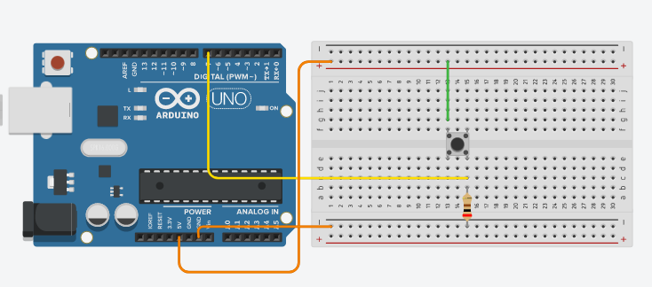

# Como usar un boton

Para usar el boton tenemos que guiarnos por el circuito que se muestra en la Figura de abajo que tiene el nombre **Pull Down**, en este circuito se observa que la fuente de voltaje se conecta al boton para luego seguir con una conexion a una resistencia y posterior conexion a tierra, ademas entre estas conexiones se observa la conexion adicional $Vout$, esta sera nuestra señal que queremos obtener para comprobar si el boton esta siendo pulsado o no, es decir, $Vout$ estará conectado a nuestro pin, en este caso el pin 7, en donde leeremos la señal. Siguiendo las instrucciones de conexion y usando el codigo que pueden ver [**acá**](./buttonUse.ino), podrán saber cuando el boton está siendo pulsado, obteniendo un 1 como resultado al usar `digitalRead()` si es que es pulsado, y un 0 en caso contrario.

## Circuito Pull Up

Ahora bien, *para que sirve el otro circuito que dice Pull Up?*, este circuito es basicamente todo lo contrario al circuito *Pull down*, en este caso al usar `digitalRead()` recibiremos un 1 como resultado si el boton **NO** está siendo pulsado y un 0 en caso de ser pulsado, esto ocurre pues la conexion $Vout$ se encuentra conectada a la fuente de voltaje antes de la conexion al pulsador.
